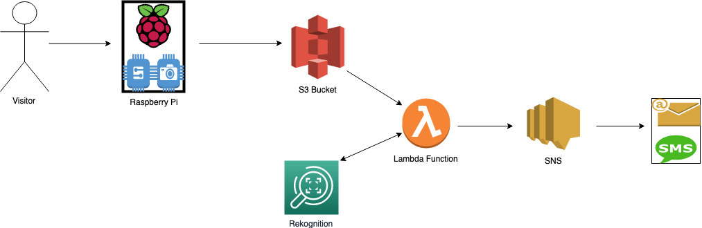
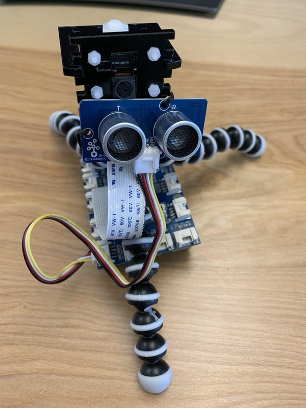

# aws-iot-ml-security-system-raspberry-pi-demo

Create a realtime face detection security system. Leveraging consumer hardware and AWS services you can create a fully functioning security system to show authorized visitors in near real time.





# Bill of Materials

Our project is based on the Raspberry Pi but should be adoptable to most platforms with minor tweaking of the python script.

What you will need:

- (1) [AWS Account](https://aws.amazon.com/free/?all-free-tier.sort-by=item.additionalFields.SortRank&all-free-tier.sort-order=asc)
- (1) [Raspberry Pi with power adapter](https://www.amazon.com/CanaKit-Raspberry-Power-Supply-Listed/dp/B07BC6WH7V/ref=sr_1_7?crid=199NBSE09XUAF&keywords=raspberry+pi+canakit&qid=1564596397&refinements=p_85%3A2470955011&rnid=2470954011&rps=1&s=gateway&sprefix=raspberry+pi+cana%2Caps%2C138&sr=8-7)
- (1) [Micro SD Card](https://www.amazon.com/SanDisk-Ultra-microSDXC-Memory-Adapter/dp/B073JWXGNT/ref=sr_1_2?fst=as%3Aoff&keywords=micro+sd+card+adapter&m=ATVPDKIKX0DER&qid=1564596647&refinements=p_6%3AATVPDKIKX0DER&rnid=303116011&s=pc&sr=1-2)
- (1) [Micro SD Card Reader](https://www.amazon.com/Kingston-microSDHC-Memory-Reader-FCR-MRG2/dp/B0028R3NCU/ref=sr_1_14?fst=as%3Aoff&keywords=micro+sd+card+adapter&m=ATVPDKIKX0DER&qid=1564596647&refinements=p_6%3AATVPDKIKX0DER&rnid=303116011&s=pc&sr=1-14)
- (1) [Raspberry Pi Camera Module](https://www.amazon.com/Raspberry-Pi-Camera-Module-Megapixel/dp/B01ER2SKFS/ref=sr_1_3?keywords=raspberry+pi+camera&qid=1564596789&refinements=p_89%3ARaspberry+Pi&rnid=2528832011&s=electronics&sr=1-3)
- (1) [UltraSonic Distance Sensor by seeed studio](https://www.amazon.com/seeed-studio-LYSB01ANFN5GM-ELECTRNCS-Seeedstudio-Grove/dp/B01ANFN5GM) and [connectors](https://www.amazon.com/Seeedstudio-Grove-Universal-Buckled-Cable/dp/B01CNZ9RJO/ref=pd_bxgy_147_2/139-0669970-9666708?_encoding=UTF8&pd_rd_i=B01CNZ9RJO&pd_rd_r=2d6e6d69-0c0f-4b54-bee6-27b9afeb6151&pd_rd_w=nWEhf&pd_rd_wg=TGmlL&pf_rd_p=a2006322-0bc0-4db9-a08e-d168c18ce6f0&pf_rd_r=GRFGG9QHYYXMTH9PMASC&psc=1&refRID=GRFGG9QHYYXMTH9PMASC)
- (1) [Seeedstudio GrovePi+](https://www.amazon.com/seeed-studio-FBA_Seeedstudio-103010002-Seeedstudio-GrovePi/dp/B01ANDPDQE/ref=sr_1_1?keywords=grovepi&qid=1564596858&s=electronics&sr=1-1#customerReviews)
- (1) USB Mouse and Keyboard
- (1) HDMI monitor with HDMI cable to see the video output for the Pi

## **AWS**

### CLOUDFORMATION

Upload the file name IoTCloudformation.template located in this repo and fill out the required information.

This will provision 90% of what is needed in your AWS account

### REKOGNITION

Create your collection ID

```
aws rekognition create-collection \
    --collection-id "MyCollection"
```

Analyze faces

```
aws rekognition index-faces --image "S3Object={Bucket=MYBUCKETNAME,Name=MYPHOTONAME.jpg}" --collection-id "MyCollection" --detection-attributes "ALL" --external-image-id "myImgID"
```

## **Raspberry Pi**

### Hardware Setup

Connect RasPi Camera [VIDEO](https://www.youtube.com/watch?v=GImeVqHQzsE)

Connect GrovePi [STEPS](https://www.dexterindustries.com/GrovePi/get-started-with-the-grovepi/raspberry-pi-model-b-grovepi/)

Connect UltraSonic Distance Sensor to D4 [STEPS](http://wiki.seeedstudio.com/Grove-Ultrasonic_Ranger/#hardware_3)

Once completed be sure to connect your normal peripherals like Mouse/Keyboard/HDMI and Ethernet (If applicable)

### Software Setup

[Install Raspbian](https://www.raspberrypi.org/documentation/installation/installing-images/). We will be using [Raspbian Buster Lite](https://www.raspberrypi.org/downloads/raspbian/)

```
Make sure to apply the latest updates and reboot.

`sudo apt update -y && sudo apt upgrade -y && sudo reboot`
```

```
Open raspi-config to start adjusting some local features

`sudo raspi-config`
```

**We Strongly encourage you to change your default password to something more secure**

```
1 > Change User password > Change default password

2 > Network Options > Configure any network settings here

4 > Localisation Options > Set your timezone and locale Options

5 > Interfacing Options > Enable Camera and Enable SSH

Optional > 7 > Advanced Options > Expand FileSystem

Finish > Should prompt you to reboot
```

```
Install PIP and Python-PiCamera

`sudo apt install python-picamera python-pip -y`
```

Download Rasberry Pi configuration folder from the [Repo] /PiCamera 

```
Install the requirements.txt

`cd aws-iot-ml-security-system-raspberry-pi-demo/PiCamera`

`pip install -r requirements.txt`
```

Install GrovePi Software

```
cd ~
curl -kL dexterindustries.com/update_grovepi | bash
sudo reboot
```

Please be sure that the firmware has been updated on the GrovePi [_here_](https://dexterind.github.io/GrovePi/fw/)

Test PiCamera - `raspistill --demo`

Test GrovePi - `Sudo i2cdetect -y 1` - [_Grovepi_](https://www.dexterindustries.com/GrovePi/get-started-with-the-grovepi/setting-software/) will give more details for testing.

**Edit Configuration File**

cd into the repo with the requirements.txt which should be located at `cd ~/aws-iot-ml-security-system-raspberry-pi-demo/PiCamera` unless you downloaded it to another directory.

Copy the config_example.yml to config.yml

`cp config_example.yml config.yml`

You must update the following items based on what you setup in your AWS Account

`nano config.yml`

Update these values based on the AWS setup section. Other items are optional at this time, the defaults should be fine for initial testing.

- access_key_id: '`MY_ACCESS_KEY_ID`'
- secret_access_key: '`MY_SECRET_ACCESS_KEY`'
- bucket_name: '`MY_BUCKET_NAME`'

You can now `sudo chmod +X s3cam.py` and run it with `python s3cam.py`

After a few seconds you should start seeing the output from the script sending the photos and taking pictures.

If you want to run this script as a service please follow this link: [Run a Service](https://www.raspberrypi.org/forums/viewtopic.php?t=197513#p1247341)
